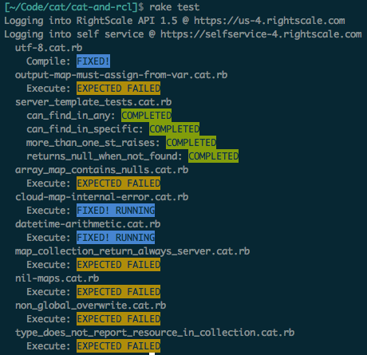

cat-and-rcl
===========

Storage bucket for misc useful RightScale SelfService things.

```
bundle install

mkdir -p ~/.right_api_client
cp login.yml.example ~/.right_api_client/login.yml

# Edit login.yml accordingly

rake -T
```

Including
=========

For any of the rake tasks that deal with templates, the template will be preprocessed
to replace any #include:/path/to/another/cat/file with the contents of that file.

This allows for shared libraries to be built and stored along side your CATs.

Example:

Main template
```
name 'cat-with-includes'
rs_ca_ver 20131202
short_description 'has some includes'

#include:../definitions/foo.cat.rb
```

foo.cat.rb
```
define foo() return @clouds do
  @clouds = rs.clouds.get()
end
```

Results in
```
name 'cat-with-includes'
rs_ca_ver 20131202
short_description 'has some includes'

###############################################################################
# BEGIN Include from ../definitions/foo.cat.rb
###############################################################################
define foo() return @clouds do
  @clouds = rs.clouds.get()
end
###############################################################################
# END Include from ../definitions/foo.cat.rb
###############################################################################
```

API Requests
============

cloudapp_list
--------------

template_compile
----------------

template_list
-------------

template_upsert
---------------

#Tests

## Test types

There are three types of tests you can run.

### Compile Only

If you have a CAT you expect to compile successfully you can use the tag
test:compile_only=true

```
#test:compile_only=true

name "UTF-8 Test"
rs_ca_ver 20131202
short_description "Caché"

parameter "foo" do
  type "string"
  label "Foo"
  default "Caché"
  operations "launch"
end
```

If you expect it to compile successfully but it doesn't due to system issues you'd
use the test:desired_state=running tag.

```
#test:compile_only=true
#test:desired_state=running

name "UTF-8 Test"
rs_ca_ver 20131202
short_description "Caché"

parameter "foo" do
  type "string"
  label "Foo"
  default "Caché"
  operations "launch"
end
```

If you expect it to fail to compile, you'd use the test:expected_state=failed
tag.

```
#test:compile_only=true
#test:expected_state=failed

name "UTF-8 Test"
rs_ca_ver 20131202
short_description "Caché"

parameter "foo" do
end

# Should fail to compile because parameter "foo" has no parameters
```

### CloudApp Executes

If you expect a CloudApp to execute successfully, you don't need to specify anything
at all.

```
name "foo"
rs_ca_ver 20131202
short_description "empty, but successful"
```

If you expect a CloudApp to execute successfully, or fail, it doesn't reach that
state due to a system issue, you want to specify the
test:desired_state=(running|failed) tag.

```
#test:desired_state=running

name "foo"
rs_ca_ver 20131202
short_description "foo"

operation "launch" do
  description "Test arithmetic"
  definition "launch"
end

define launch() do
  $result = 1 + 1
  if $result != 2
    raise "RCL Can't do math"
  end
end
```

If you expect a CloudApp to execute and fail, you'll want to specify the
test:expected_state=failed tag.

```
#test:expected_state=failed

name "foo"
rs_ca_ver 20131202
short_description "foo"

operation "launch" do
  description "Raise an error, failing the cloud app"
  definition "launch"
end

define launch() do
  raise "This oughta do it."
end
```

### Special Operations Execute

_Not yet implemented_

## Results
Green - Test completed successfully and with the expected result
Yellow - Test completed successfully but did not have the tag:desired_state
Blue - Test completed successfully and did have the tag:desired_state
Red - Test did not complete successfully, or the tag:expected_state was not matched



## Test Tags
Simple tagging to identify what to test, and what the desired result is.

### test:compile_only=true
This tag indicates that simply being able to "compile" this test file represents
success.

### test:expected_state=(failed|running)
Cause sometimes it's easier to let the test "fail" or throw an exception than
to create the logic to allow it to finish.

### test:desired_state=(failed|running)
This tag implies that under normal circumstances the test would complete with the
specified state.  However, it's expected that the test won't complete with
that state due to system bugs or other things.

When a test with this tag completes in a state other than the specified state
it will be marked Yellow.

When a test with this tag completes in the specified state it will be marked Green
